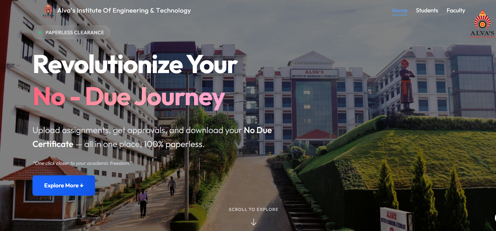
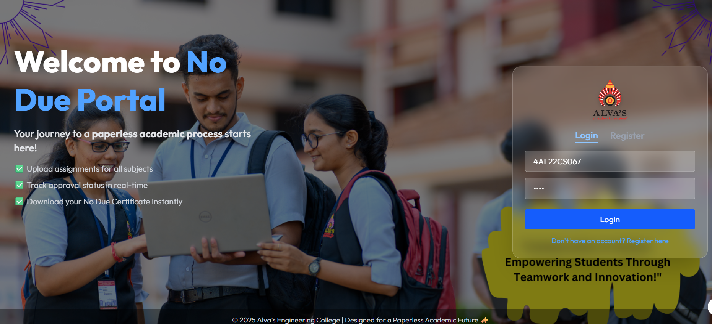
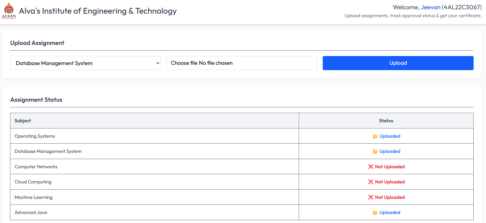
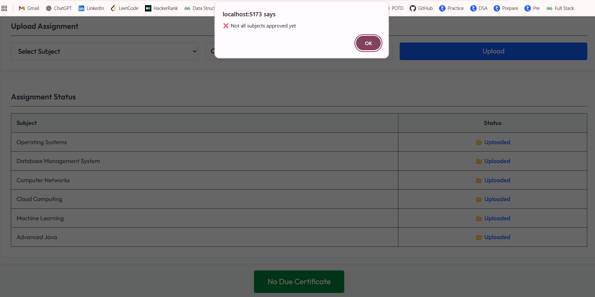
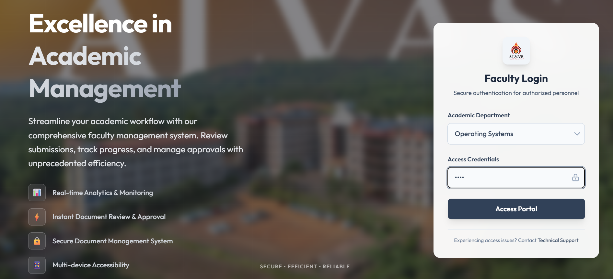
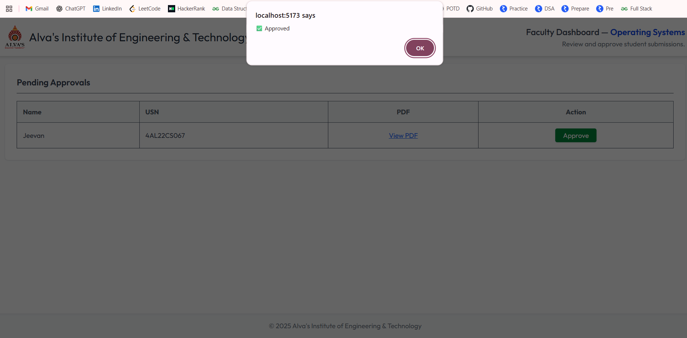
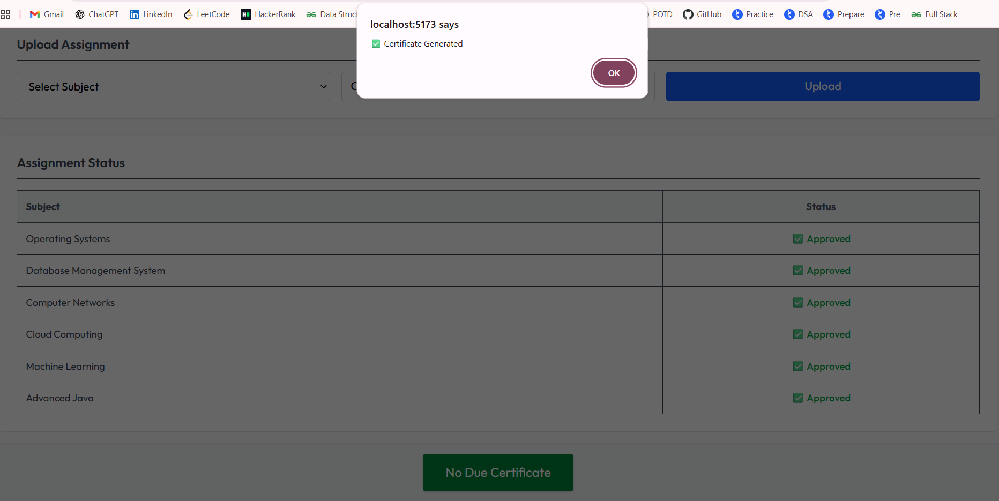
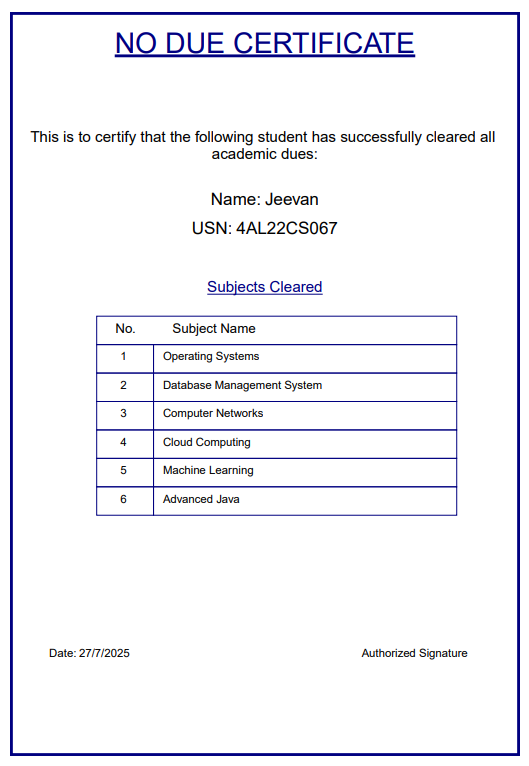

# ✅ **No Due System**  

### **👨‍🎓 Project By:**  
**K Jeevan Kumar**  
**Final Year, Alva's Institute of Engineering & Technology**  

---

## **📌 Table of Contents**  

| Section | Description |
|---------|-------------|
| [📌 Overview](#-overview) | Project Introduction & Features |
| [🛠️ Tech Stack](#️-tech-stack) | Frontend & Backend Technologies Used |
| [📂 Project Structure](#-project-structure) | Folder Structure of the Project |
| [🖼️ Results](#️-results) | Screenshots of Application Pages |

---

## **📌 Overview**  
The **No Due System** is a web-based application that digitalizes the traditional no-due clearance process for students. Students can upload their assignments for various subjects, and faculty can review and approve them online. Once all subjects are approved, the system automatically generates a **No Due Certificate** in PDF format.  

### **✨ Key Features:**  
✅ **Paperless Workflow** – Digital submission & approvals  
✅ **Real-Time Tracking** – Track approval status anytime  
✅ **Automated Certificate Generation** – PDF generated automatically  

---

## **🛠️ Tech Stack**  

### **Frontend**  
- ⚡ **React.js (with Vite)** – Fast & responsive UI  
- 🎨 **Tailwind CSS** – Modern styling framework  
- ✨ **Framer Motion** – Smooth animations  

### **Backend**  
- 🔥 **Node.js with Express** – Server-side APIs  
- 📦 **MongoDB** – Database for students, faculty, and assignments  
- 📑 **Mongoose** – ORM for MongoDB  
- 📤 **Multer** – File uploads for assignments  
- 📝 **PDFKit** – Auto-generated No Due Certificates  

---

## **📂 Project Structure**  

```bash
NoDueManagementSystem/
├── client/                       # React frontend application
│   ├── src/
│   │   ├── pages/                 # React pages (Student, Faculty, Dashboard, etc.)
│   │   ├── components/            # Reusable UI components
│   │   ├── services/              # API request handlers (Axios)
│   │   ├── context/               # AuthContext for student & faculty
│   │   └── assets/screenshots/    # Project screenshots
│   └── public/                    # Static files (logo, background images)
│
├── server/                        # Node.js + Express backend
│   ├── models/                    # Mongoose schema models (Student, Faculty)
│   ├── routes/                    # API routes
│   ├── controllers/               # Business logic & API handlers
│   ├── middleware/                # Auth & file upload handling
│   ├── uploads/                   # Uploaded assignments & generated certificates
│   ├── utils/                     # Helper functions (generateCertificate.js)
│   └── config/                    # Database & environment configurations
│
├── .env                           # Environment variables
├── package.json                   # Project dependencies
└── README.md                      # Project documentation
```

## **🖼️ Results**  

### 🏠 **Home Page**  
  
<p align="left">🏫 <i>Clean and intuitive <b>Home Page</b> introducing the No Due System.</i></p>  

---

### 👨‍🎓 **Student Registration & Login**  
  
<p align="left">📝 <i>Students register & log in using <b>Name, USN, and Password</b>.</i></p>  

---

### 📤 **Upload Assignment**  
  
<p align="left">📚 <i>Students upload their <b>assignment PDFs</b> for each subject.</i></p>  

---

### ✅ **Faculty Approval Requirement**  
  
<p align="left">🔐 <i>The certificate is generated <b>only after all faculty members approve</b>.</i></p>  

---

### 👩‍🏫 **Faculty Login**  
  
<p align="left">🔑 <i>Faculty can log in securely using <b>Subject Name & Password</b>.</i></p>  

---

### 🗂️ **Faculty Approval Dashboard**  
  
<p align="left">📄 <i>Faculty reviews and <b>approves assignments</b> based on uploaded PDFs.</i></p>  

---

### 🏆 **No Due Certificate Generated**  
  
<p align="left">🎉 <i>Once all approvals are done, students can <b>generate their official No Due Certificate</b> in PDF format.</i></p>  

---

### 📜 **No Due Certificate**  
  
<p align="left">🎉 <i>No Due Certificate </i></p>  


